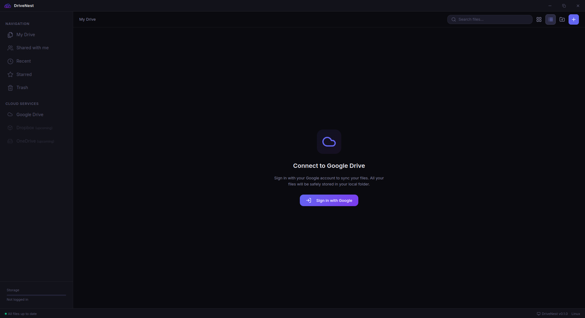

# 🌌 DriveNest: Intelligent Desktop Cloud Management

**DriveNest** is a modern **Electron** client that brings your Google Drive experience to the desktop, focusing on performance, aesthetics, and a premium user experience. It's not just a file manager; it's a productivity powerhouse designed for Linux users.

---



## ✨ Features

### 🛡️ Secure & Private
- **OAuth 2.0 Integration**: Your data is processed directly through Google.
- **Secure Storage**: Your access tokens are stored securely using system-level encryption.
- **Data Privacy**: Your file contents are never transmitted to any third-party server; everything stays on your device.

### 🎨 Premium User Experience
- **Modern Glassmorphism**: Transparency effects and UI elements with depth for a sleek look.
- **Custom Window Design**: A stylish, custom Title Bar that breaks away from standard OS frames.
- **Dynamic Views**: Instantly switch between **Grid** and **List** views based on your needs.
- **Dark Mode**: A carefully balanced, high-contrast deep dark theme.

### 📂 Advanced File Management
- **Smart Starring**: Find your important files instantly in the "Starred" tab.
- **Advanced Trash**: Restore accidentally deleted files with one click or clear them permanently.
- **Quick Breadcrumb Navigation**: Navigate through folders seamlessly.
- **Instant Search**: Filter your files in seconds using the power of the Google Drive API.

### 🌐 Virtual Drive (FUSE Mount) - **Exclusive**
- **Native Experience**: Mount Google Drive as a real "Local Disk" on your operating system (Compatible with Dolphin, Nautilus, etc.).
- **Smart VFS Caching**: Advanced caching and read optimizations for a lag-free experience when opening files.
- **One-Click Setup**: A wizard that automatically detects and installs necessary system tools (rclone/fuse).
- **Silent Automount**: Automatically mounts the drive on login and safely unmounts on exit.

---

## 🏗️ Technical Architecture

DriveNest combines modern web technologies with desktop power:

- **Frontend (Renderer)**: 
  - **React 18** for a reactive component structure.
  - **TypeScript** for type-safe coding.
  - **Tailwind CSS** for customized, fast, and lightweight styling.
  - **Lucide Icons** for consistent iconography.

- **Backend (Main Process)**:
  - **Electron** main process for file system and network management.
  - **IPC (Inter-Process Communication)**: Secure and optimized inter-process communication.
  - **SQLite**: Local tracking of file metadata for rapid access.

- **API Layer**:
  - **Google Drive API v3**: Stable connection using official Google libraries.

---

## 🚀 Developer Guide

### Installation and Running

1. **Install Dependencies**:
   ```bash
   npm install
   ```

2. **Configure Environment Variables**:
   Create a `.env` file and add:
   ```env
   GOOGLE_CLIENT_ID=YOUR_GCP_CLIENT_ID
   GOOGLE_CLIENT_SECRET=YOUR_GCP_CLIENT_SECRET
   ```

3. **Start in Development Mode**:
   ```bash
   npm run dev
   ```

4. **Type Checking**:
   ```bash
   npm run typecheck
   ```

---

## 💡 Troubleshooting

### Google Verification Warning
Since the app is not yet officially verified by Google, you might see a warning during login.
1. Click the "Advanced" button.
2. Click the "Go to DriveNest (unsafe)" link.
This only indicates the app is in "development mode"; your data remains completely secure.

---

## 🚀 Roadmap

DriveNest aims to be a full-scale **Multi-Cloud Workstation**:

### 1. 📂 Multi-Cloud Support (Coming Soon)
- **Dropbox & OneDrive**: Manage all your cloud accounts from a single interface and a single virtual drive.
- **Unified Search**: Search across all cloud services simultaneously.

### 🤖 AI Integration
- **Smart Tagging**: Automatically categorize uploaded photos using AI (nature, documents, scenery, etc.).
- **Document Summarization**: Summarize long PDFs and text files with one click.

---

## ⚖️ Legal

- [Privacy Policy](PRIVACY.md)
- [Terms of Service](TERMS.md)

---

## 📄 License & Contribution

This project is protected under the **MIT License**. If you wish to contribute, please open a 'Pull Request' or report an issue.

---
*DriveNest — Your cloud files, closer than ever.*
